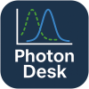
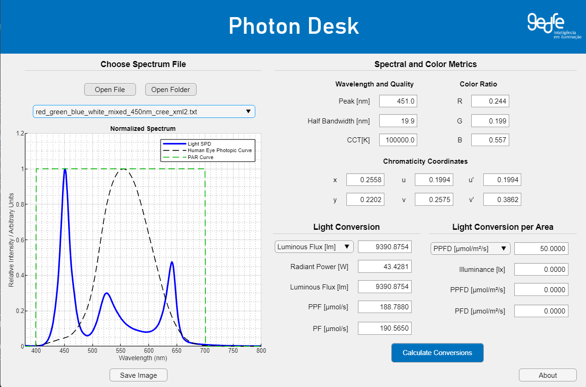
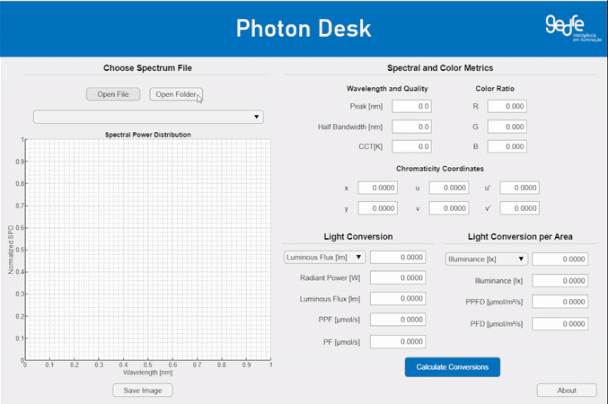
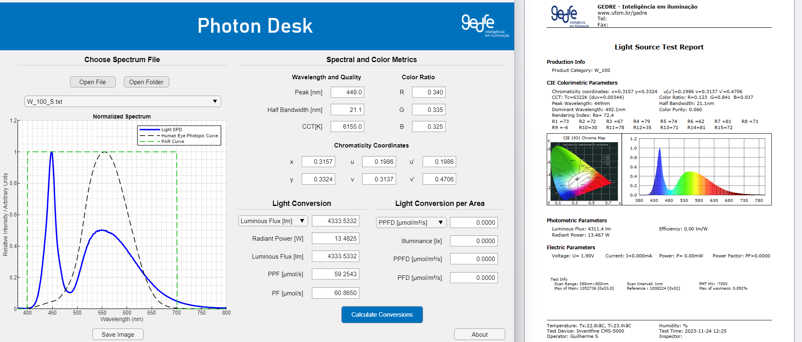
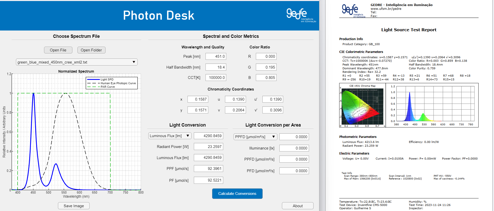

> 🔗 [🇧🇷 Read this page in Portuguese](README_pt.md)

# Photon Desk

**Photon Desk** is a light spectrum analysis and conversion tool based on spectral data. It allows users to import spectra from various light sources, visualize spectral curves, and automatically compute photometric, radiometric, and colorimetric metrics with precision.

## 📂 Project Structure

The repository is organized into three main folders:

- `core/`: MATLAB source code (`.m`) with base functions, which can be run manually.
- `app/`: Contains the `.mlapp` file built with MATLAB App Designer.
- `sample_spectra/`: A collection of sample spectra from real light sources, acquired using an integrating sphere.

---

## 🧪 Features

- Support for `.txt`, `.csv`, and `.mat` spectral data files.
- Automatic generation of normalized spectral plots.
- Automatic calculation of:
  - **Luminous flux (lm)**
  - **FWHM (full width at half maximum)**
  - **CCT (correlated color temperature)**
  - **Chromaticity coordinates (x, y, u, u′, v, v′)**
  - **RGB ratio**
  - **Dominant wavelength**
- Conversion between photometric and radiometric units (lm, W, PPF, PF).
- Conversion of light per area units (lux, PPFD, PFD).

---

## 🖼 Interface

The main interface includes:

- Selection of individual files or folders containing multiple spectra.
- Spectral plot with reference curves (human eye response, PAR).
- **Spectral and Color Metrics** section showing key color and quality indicators.
- **Light Conversion** section for full radiant power-based conversions.
- **Light Conversion per Area** section for area-based metrics.

---

## 📁 File Format

The app accepts `.txt`, `.csv`, or `.mat` files with **2 or 3 columns**. The first row must contain a header indicating the variables.

**Minimum requirements:**
- First column: Wavelength (nm)
- Second column: SPD (normalized or absolute)
- Third column (optional): **Non-normalized** radiant power (W/nm or mW/nm)

**Valid header examples:**

- `"Wavelength(nm)","SPD","Radiant Power(W/nm)"`
- `WL(nm)    SPD    Power(mW/nm)`

The app will try to detect the power unit (W or mW) from the header. If not specified, it assumes Watts and shows a warning.

---

## 🎞 Demonstration

The GIF below shows a usage example of Photon Desk:  
it demonstrates selecting a spectral file, inputting values for unit conversion, and clicking the calculate button.  
The app then performs the conversions and displays the computed spectral and color metrics in the interface.

---

## 🛠 Installation

To use Photon Desk, follow these steps:

1. Visit the [Releases](https://github.com/GuilhermeRS11/PhotonDesk-App/releases) page and download:
   - `PhotonDeskApp.exe`: the app installer.
   - `sample_spectra.zip`: a set of example spectral measurements (optional).

2. Run the `PhotonDeskApp.exe` file.

3. The installer will handle everything automatically, including:
   - Downloading and installing the **MATLAB Runtime** (~500 MB), if not already installed.
   - Installing the Photon Desk application.

4. (Optional) Unzip the `sample_spectra.zip` file to access ready-to-use example spectra. These can be loaded using the "Open Folder" button inside the app.

> ⚠️ MATLAB Runtime is required to run the app, but no MATLAB license is needed.

---

## 📊 Accuracy

The following charts compare results obtained using Photon Desk (left) with reports from a professional integrating sphere **Inventfine CMS-5000** (right).

This comparison validates the accuracy of the application's calculations and confirms **strong agreement** between the app and professional lab equipment.

Additionally, all conversions between photometric, radiometric, and photosynthetically active radiation units (like **PPF** and **PPFD**) are based on the reference article:

> [Photometry and Photosynthesis: From Photometry to PPFD (Revised)](https://www.researchgate.net/publication/284157299_Photometry_and_Photosynthesis_From_Photometry_to_PPFD_Revised)

This scientific source was used to ensure the reliability of transformations between visible light and photosynthetic light energy.

---

## 🚧 Future Improvements

- Add more spectral samples to the `sample_spectra` folder, with detailed annotations.
- Port the app to **Python + PyQt** to increase cross-platform support and flexibility.
- Develop an **AI-based tool** to extract spectral data from **images** (using OCR and curve recognition).

---

## 👤 Author

Developed by **Guilherme Ribeiro Silveira**, Electrical Engineering Master's student at UFSM  
Affiliated with the **GEDRE – Intelligent Lighting Research Group**

📧 guilhermeribeiro201342@gmail.com  
🔗 [LinkedIn](www.linkedin.com/in/guilhermeribeirosilveira) | [GitHub](https://github.com/GuilhermeRS11)

---

## 📜 License

This project is licensed under the **GPL-3.0**. See the `LICENSE` file for more details.
